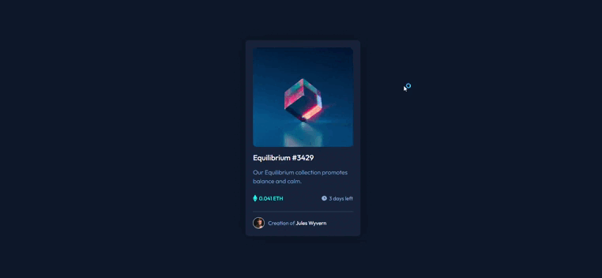

# Frontend Mentor - Solução do componente de visualização de NFT

Esta é uma solução para o [desafio do componente de visualização de NFT no Frontend Mentor](https://www.frontendmentor.io/challenges/nft-preview-card-component-SbdUL_w0U).

Os desafios do Frontend Mentor ajudam a aprimorar as habilidades de desenvolvimento front-end por meio da criação de projetos baseados em interfaces e situações próximas às encontradas no mercado.

## Índice

* [Visão geral](#visão-geral)

  * [O desafio](#o-desafio)
  * [Screenshot](#screenshot)
  * [Links](#links)
* [Meu processo](#meu-processo)

  * [Tecnologias utilizadas](#tecnologias-utilizadas)
  * [O que eu aprendi](#o-que-eu-aprendi)
  * [Recursos úteis](#recursos-úteis)
* [Autor](#autor)
* [Agradecimentos](#agradecimentos)

## Visão geral

### O desafio

Os usuários devem ser capazes de:

* Visualizar o layout ideal dependendo do tamanho da tela do dispositivo.
* Visualizar os estados de `hover` dos elementos interativos.

### Screenshot



### Links

* URL do site: [Clique aqui](https://werneckx.github.io/frontendmentor-challenge-NFT/)

## Meu processo

### Tecnologias utilizadas

* HTML5 semântico
* CSS3
* CSS Custom Properties (variáveis CSS)
* Flexbox
* Design responsivo
* Abordagem Desktop First

### O que eu aprendi

Neste projeto pude aprender mais sobre a utilização de pseudo-elementos e pseudo-classes do CSS.

Utilizei os pseudo-elementos `::before` e `::after` para criar a camada de sobreposição e o ícone de visualização sobre a imagem do NFT. A pseudo-classe `:hover` foi utilizada para controlar a exibição desses elementos quando o usuário passa o mouse sobre a imagem.

```css
/* Estilização do Hover */
.card .image-link {
    display: flex;
    justify-content: center;
    align-items: center;
    position: relative;
    border-radius: 10px;
}

.card .image-link::before {
    content: "";
    position: absolute;
    width: 100%;
    height: 100%;
    background-color: var(--primary-cyan);
    opacity: 0;
    transition: 0.5s ease-in-out;
    border-radius: 10px;
}

.card .image-link::after {
    content: "";
    position: absolute;
    width: 100%;
    height: 100%;
    background: url(../images/icon-view.svg) no-repeat center;
    opacity: 0;
    transition: 0.5s ease-in-out;
}

.card .image-link:hover::before {
    opacity: 0.4;
}

.card .image-link:hover::after {
    opacity: 1;
}
```

Além disso, pratiquei a utilização de Flexbox para organização dos elementos, variáveis CSS para facilitar a manutenção das cores e técnicas de responsividade para adaptar o componente a diferentes tamanhos de tela.

### Recursos úteis

* [Frontend Mentor](https://www.frontendmentor.io/) — Plataforma utilizada para obter o desafio e praticar desenvolvimento front-end.
* [MDN Web Docs](https://developer.mozilla.org/) — Documentação utilizada como referência para HTML e CSS.

## Autor

**Edson Rodrigues**

* GitHub: [@werneckx](https://github.com/werneckx)
* Frontend Mentor: [@werneckx](https://www.frontendmentor.io/profile/werneckx)

## Agradecimentos

Agradeço ao **Frontend Mentor** pela disponibilização dos desafios, que proporcionam uma excelente forma de praticar desenvolvimento front-end através de projetos baseados em interfaces reais.

Também agradeço à comunidade do Frontend Mentor pelos exemplos, soluções e referências que ajudam no processo de aprendizado.
